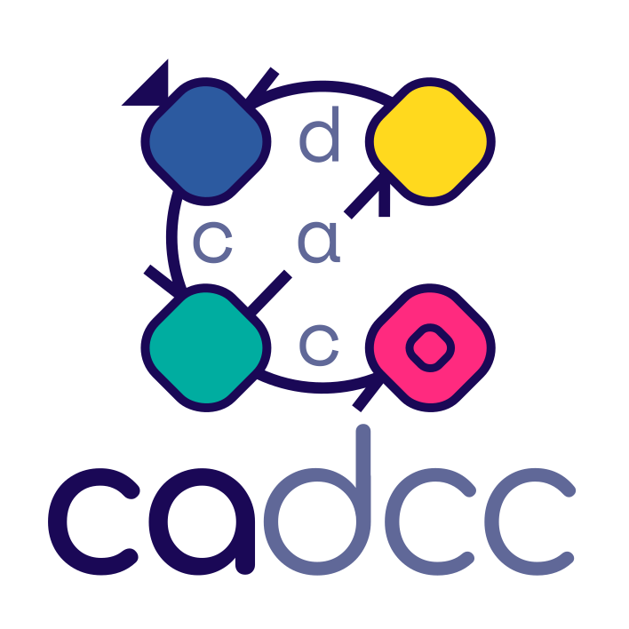

  Hi, I'm <b>Eric</b>. AKA <b>Nyveon</b>. 

<!-- ---------------------------------------------------------------------------- -->

<h2 align="center"> Tools & Bots </h2>

  

  

<!-- ---------------------------------------------------------------------------- -->

<h2 align="center"> Web Extensions </h2>

  

  

<!-- ---------------------------------------------------------------------------- -->

<h2 align="center"> Game Development </h2>

<h3>
    <a href="https://www.minibunnies.com/">
        The Mini Bunnies
    </a>
    - Indie game studio, making <a href="https://store.steampowered.com/app/1602550/After_School_Afterlife/">After School Afterlife</a>.
</h3>

<h3>
    <a href="https://nyveon.com/">
        My website
    </a>
    - 1st place in many Game Jams!
</h3>

<!-- ---------------------------------------------------------------------------- -->

<h2 align="center"> University </h2>

<h3>
    <a href="https://github.com/Nyveon/Nyveon/blob/main/University.md">
        University of Chile
    </a>
    - My Courses/Projects.
</h3>

<h3>
    <a href="https://cadcc.cl/">
        CaDCC
    </a>
     - UChile CS Student Council.
</h3>

<!-- ---------------------------------------------------------------------------- -->

<h2 align="center"> Technologies </h2>

<h3 align="center">
    Languages⏵
    
    
    
    
    
    
    
    ﹊
    
    
    
    
    
    
    
    ⏴Web-Dev 
</h3>

<h3 align="center" >
         Data⏵
    
    
    
    
    ﹊
    
    
    
    
    ⏴Game-Dev
</h3>

<h3 align="center" >
           IDEs⏵
    
    
    
    ﹊
    
    
    
    ⏴Audio-Visual
</h3>

<h3 align="center" > Workflow⏵
    
    
    
    ﹊
    
    
    
    ⏴Writing   
</h3>

<!-- ---------------------------------------------------------------------------- -->

<h2 align="center"> My GitHub Stats </h2>

  

  

 

<h5 align="right">
    Icons from: https://simpleicons.org
</h5>